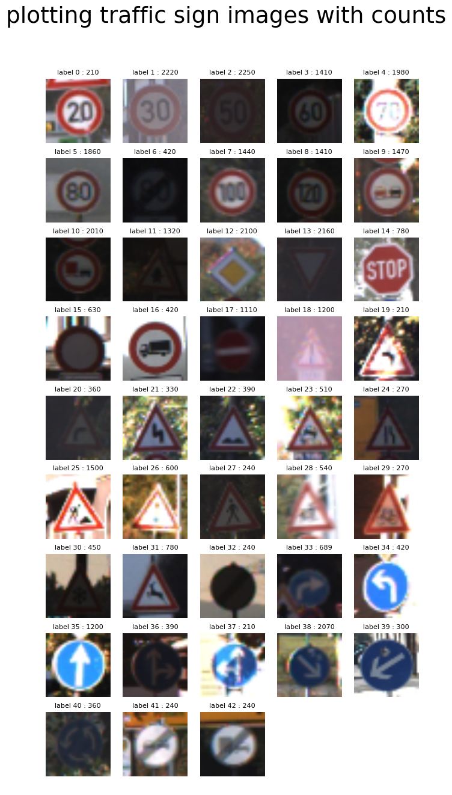

# Traffic Sign Recognition by CNN
 Traffic Sign Recognition by Convolutional Neural Network.  
 Datasets is [German Traffic Sign Dataset](http://benchmark.ini.rub.de/?section=gtsrb&subsection=dataset). Finally I get 97.8% accuracy(Test sets).
 
---
## Step 0: Load The Data


```python
# Load pickled data
import pickle

# TODO: Fill this in based on where you saved the training and testing data

training_file = './train.p'
testing_file = './test.p'

with open(training_file, mode='rb') as f:
    train = pickle.load(f)
with open(testing_file, mode='rb') as f:
    test = pickle.load(f)
    
X_train, y_train = train['features'], train['labels']
X_test, y_test = test['features'], test['labels']
```

---

## Step 1: Dataset Summary & Exploration

The pickled data is a dictionary with 4 key/value pairs:

- `'features'` is a 4D array containing raw pixel data of the traffic sign images, (num examples, width, height, channels).
- `'labels'` is a 2D array containing the label/class id of the traffic sign. The file `signnames.csv` contains id -> name mappings for each id.
- `'sizes'` is a list containing tuples, (width, height) representing the the original width and height the image.
- `'coords'` is a list containing tuples, (x1, y1, x2, y2) representing coordinates of a bounding box around the sign in the image. **THESE COORDINATES ASSUME THE ORIGINAL IMAGE. THE PICKLED DATA CONTAINS RESIZED VERSIONS (32 by 32) OF THESE IMAGES**

```python
### Replace each question mark with the appropriate value.

n_train = './train.p'
n_test = './test.p'
image_shape = X_train.shape[1:]  # (32, 32, 3)
n_classes = len(set(y_train))    #  43
```



----
## Step 2: How to preprocess the data. The process I choose that technique

Like this paper : http://yann.lecun.com/exdb/publis/pdf/sermanet-ijcnn-11.pdf,<br/><br/>
<font size=3><b>RGB to YUV conversion</b><br/></font>
the reason image/video codecs are YUV is so they can reduce the resolution of the U and V channels while keeping Y at full resolution, because luminance is more important than color.<br/>   
But, I don't think YUV by itself would be a big advantage over RGB.<br/><br/>
And, If you can reduce the resolution of U and V in a way that's compatible with convolutional nets, your net should be half the size and therefore twice as fast, without much loss of accuracy.<br/><br/>
However, blow image shows that "Y" and "Y_100, UV_8" are better than RGB datasets.<br/>
So I choose YUV conversion<br/><br/>
・<b>"Y_100, UV_8"</b> means Y channle connect 100 kernel and UV channle connect 8 kernel.<br/><br/>
<font size=3><b>data scale [0, 1]</b> :  X_train / 255<br/></font>
This is for activate function.<br/>
</body>

<body></body>

## Step 3: How to set up the training, validation and testing data for the model.

Like this paper : http://yann.lecun.com/exdb/publis/pdf/sermanet-ijcnn-11.pdf,  

The dataset "GTSRB" were extracted from 1-second video sequences which each track has 30 samples. in other words, Every 30 images is from a single sign traffic.     
  
So, I ensure the validation set would have at least one image per traffic sign, per 30 images.

So I separate each track to two segments.  
One is training sets that have about 27 or 28 images per track.    
The other is validation sets that have 2 or 3 images per track

That means one of the images in X_train[:30] will go into validation set, as well as one image from X_train[30:60]  
<br>
<body><b><font size=3>2 : How did you generate the data?</font></b></body>

I tried to generate additional data by "blur original images".  
Generally, by building a jittered dataset, the models would probably increase robustness.

But there is no differences between original datasets and new datasets in terms of accuracy(test).  
So I don't add new data to original datasets, and I use original datasets.  

**Below image is comparison with "New Datasets" and "Original Datasets"**  
"378" and "776" means Batch Size

<body></body>
## final architecture (Type of model, layers, sizes, connectivity, etc.)

<body><font size="3"><b>I made a multi-scale convolutional network.</b></font><br/></body>

**inputs data : [batch, 32, 32, 3]  YUV data**  
------------------------1st stage-------------------------  
input = inputs data  

**conv1 + ReLU : kernel size = 5, layer width = 108**  
channel Y connect 100 kernel.  
channnel UV connect 8 kernel.  

**max pooling : kernel size = 2**   
**Batch Normalization**  
 
output = "conv1"  
------------------------2st stage-------------------------  
input = "conv1"  

**conv2 + ReLU : kernel size = 3, layer width = 200**  
**max pooling : kernel size = 2**    
**Batch Normalization**  

output = "conv2"  

<body>
------------------------3st stage-------------------------<br/>
<font size=3, color='red'><b>combine "conv1(flatten)" with "conv2(flatten)"</b></font><br/></body>
input = concat "conv1(flatten)" and "conv2(flatten)"  

**fully network + ReLU : layer width = 300**  
**Batch Normalization**  

output = "fc1"  
------------------------4st stage-------------------------  
input = "fc1  

**out : layer width = 43**  

<body>
<font size=3, color='red'><b>・About below images</b></font><br/>
"BP" means the flow of layer "conv -> Batch Normalization -> Max Pooling"  
"PB" means the flow of layer "conv -> Max Pooling -> Batch Normalization"  

"No Fully Layer" means there is no fully layer. In other words, This network don't have 3st stage  
"One Fully Layer" means this architecrue is same to final architecture.  
"Two Fully Layer" means add Fully layer2 to final architecture. layer width = 100  
</body>
<body></body>

### Question 4

#### How to train your model? (Type of optimizer, batch size, epochs, hyperparameters, etc.)_

**Answer:**  
**Type of optimizer : Adam **   
Adam itself does a learning rate decay, so I don't use learning decay.

**learning rate = 0.0005**  
**batch size : 378**  
**epochs : 200**  

<body></body>
